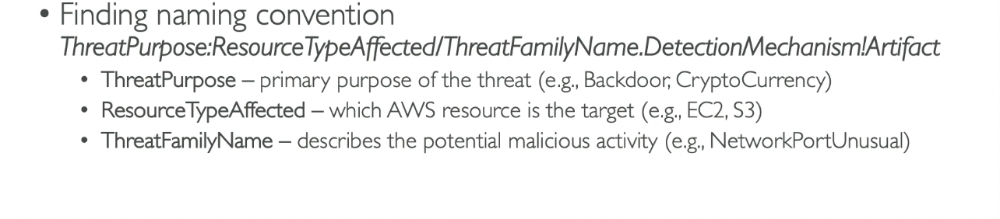
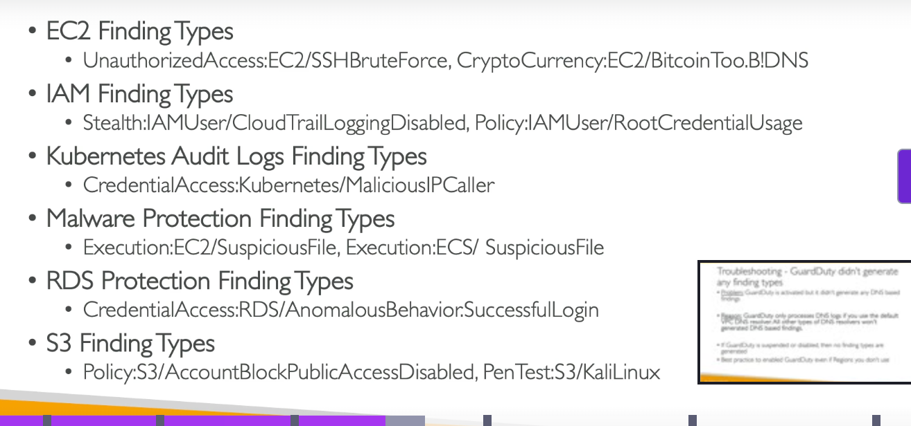
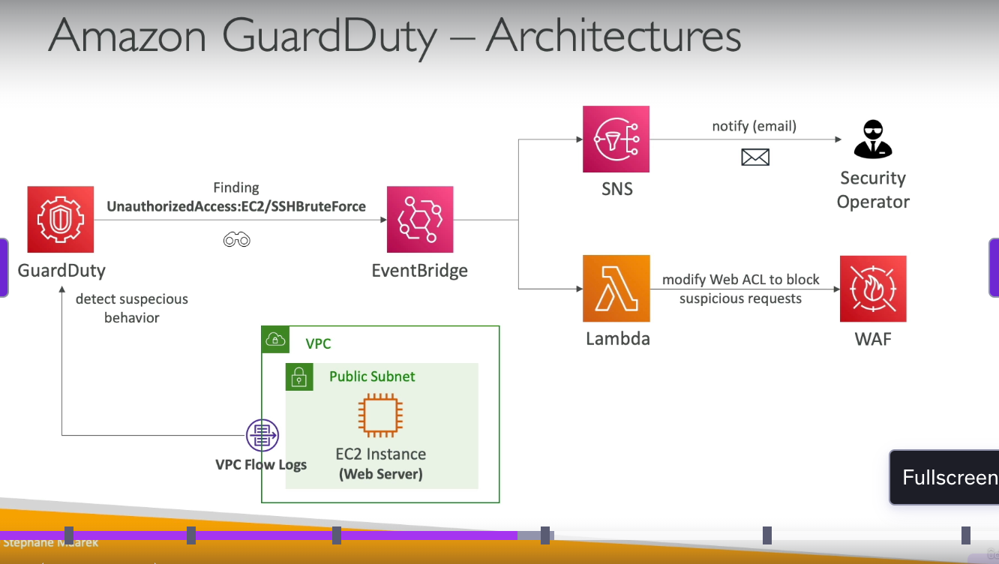
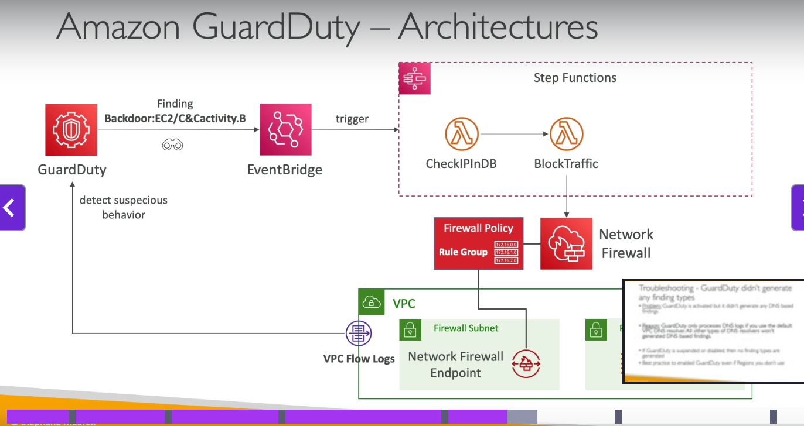
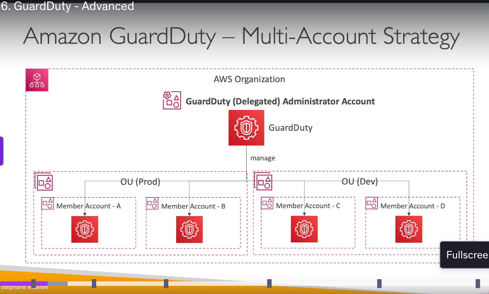
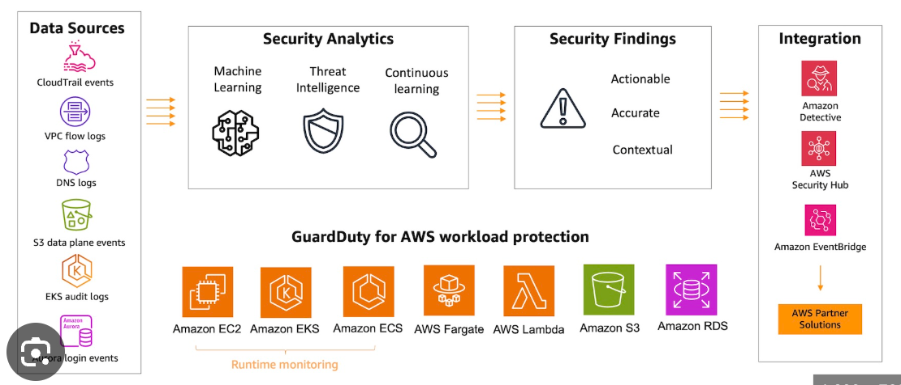
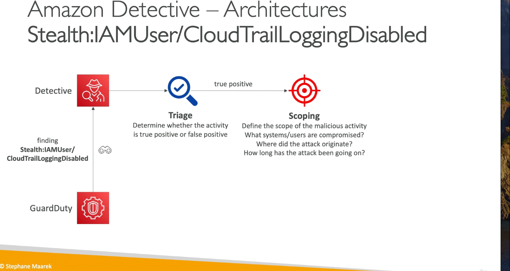

# Domain 1 - Threat Detection and Incident Response

### GuardDuty
- Intelligent Threat discovery to protect AWS accounts
- Uses machine learning algorithms, anomaly detection, third party data
- Can be enabled with one click, `it has a 30 days trial`, no additional installation of software is required
- protects against `Crypto` attacks, special finding for it.
- Guardduty only process DNS Logs if you are using the `default VPC DNS Resolver` and not any third party resolver.
- Best Practice: Enable it in regions you do not even use or have your DR infra.
- Suppression Rules:
 - Helps in filtering of events through false positives, or low value findings.
 - Can suppress entire types or more granular level, not sent to sec hub, s3, detective, eventbridge etc.
- Guardduty has a sev level till 0.1-8+.
    
    
- Input data to GuardDuty includes:
    - `CloudTrail Logs`: unusual API calls, unauthorized deployments(Both management and object logs if enabled)
    - `VPC Flow Logs`: unusual internal traffic detection, unusual IP address detection
    - `DNS Logs`: compromised EC2 instances sending encoded data within DNS queries
    - `Other Sources`: EKS Audit Logs, RDS and EBS.
- Notifies the users in case of findings
- Has integration with AWS Lambda which can be invoked through event bridge.
    
    
- We can invoke a lambda or send message to SNS Topic through eventbridge like usual. If using multi account each event will be sent to admin account + member account where it originated from.
- You can manage multiple accounts in guarduty through the help of AWS Organizations, Sending invite through Guardduty.
- Admin account can add, remove member accounts, manage the trusted IP list, threat list.
- We can specify in Organizations as the delegated adminstrator for Guardduty.
    

- Security Hub
### Detective
- Some findings require complex and long process.
- Identifies the root cause of security issues using ML and Graph theory.
- Automatically Collect and process events from cloudtrail, flow logs,
- Produce visualizations too.
- Any finding of guardduty should go to detective and then it is triaged.

### EC2
- **Compromised EC2 Instance**: Capture Instance Metadata, Enable Termination Protection
    - Isolate the instance and then replace the SG with the sg with no outbound traffic
    - Detach the Instance from the ASG or any ELB.
    - Snapshot the EBS Volume for analysis for malwares and then create a forensics EC2 Instance , attach the EBS Volume and then run a scan for getting the rootcause.
    - Tag the Ec2 instance for InfoSec Team.
### Penetration Testing:
- Without prior approval can do for your infrastructure for 8 services.
- ELB,EC2
- NAT Gateway
- RDS, Aurora
- Cloudfront, API Gateway
- Lambda and Lambda Edge, Lightsail
- Elastic BeanStalk.
- Some activities are not allowed: API Request flooding, protocol flooding, port flooding, ddos attack, DNS Zone Walking or DNS Spoofing.
#### DDOS Simulation:
- Controlled DDos attack, must be performed by AWS DDos Test Partner. The target can be either protected resources or Edge Optimized API Gateway subscribed to shield advanced.
- Attack should not be done through AWS resources
- Not more than 20gigabit/second
- Attack must not exceed 5 million/second for cloudfront or 50k packets for any other service.
### IAM
- **IAM Access Analyer**: Helps in finding resources which are shared outside of the account as well like S3 Buckets, IAM Roles, KMS key policy, Lambda, SQS Queues, Secret Manager Secrets. You define a zone of trust like your aws organizations, anything outside this trust zone will be reported as a finding.
- You can validate the policy against policy grammar, best practices, provide actionable recommendations.
- We can generate the policy using analyzer based on access activity based on cloudtrail logs it gives you a policy based on your tracking activity. 
#### IAM Credential Report
IAM Credential Report is a CSV-formatted report which lists all users in the accounts + status of their various credentials, including
- Passwords: enabled, last used, last rotated, next rotation.
- Access Keys: similar to above + last used.
- MFA devices: similar to above.
**CLI commands for IAM Credential Reports**
```sh
# generate a credential report
aws iam generate-credential-report
# download a credential report / same API call but base64 decode
aws iam get-credential-report
aws iam get-credential-report --output text --query Content | base64 -D
```
Required permissions to generate IAM Credential Reports
```sh
GenerateCredentialReport: create report
GetCredentialReport: download report
```
**An IAM Policy with permissions to generate IAM Credential Reports**
```json
{
    "Version": "2012-10-17",
    "Statement": [{
        "Sid": "VisualEditor0",
        "Effect": "Allow",
        "Action": [
            "iam:GenerateCredentialReport"
        ],
        "Resource": "*"
    }]
}
```
### AWS Abuse Report
- When you suspect any resource used for Spam or illegal purpose,Eg: malware, ddos.
- Generate a abuse report then contact AWS Trust and Safety Team.
- Need to responsd within 24 hours otherwsie account will be suspended.