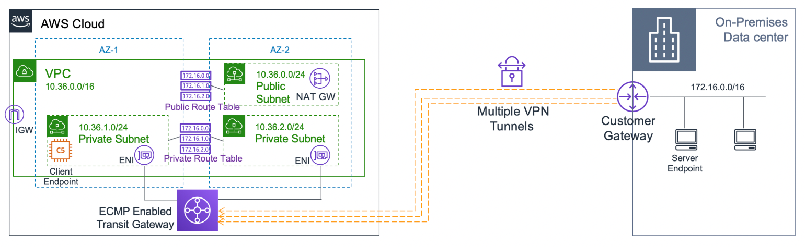
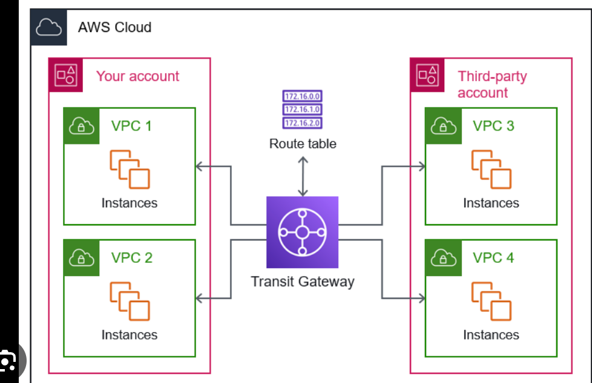
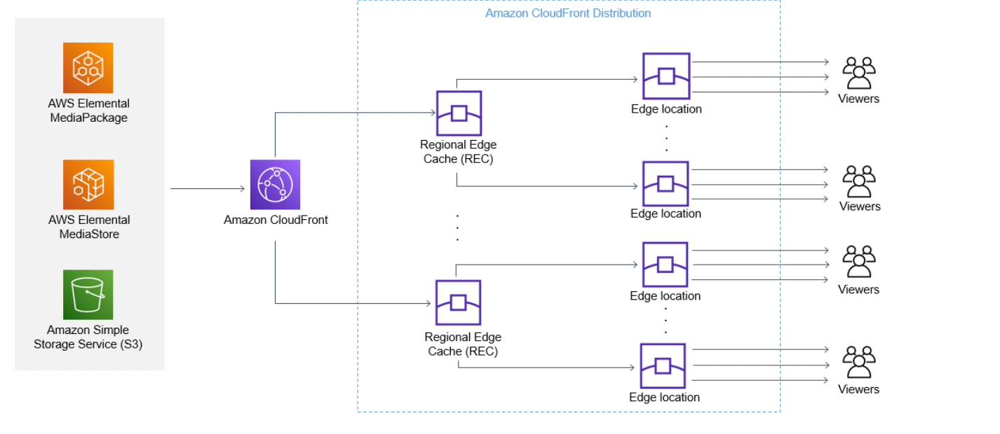
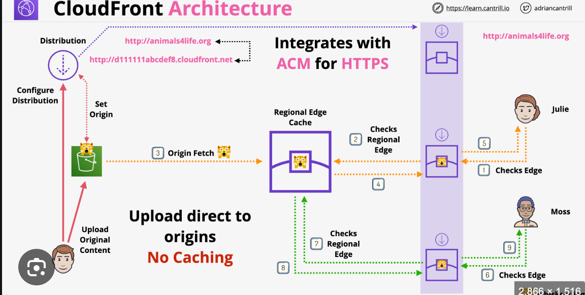

# Domain 3 - Infrastructure Security
- Bastion Server
- VPN
- VPC Peering
- DNS
- EndPoints
- PrivateLink
- NACL & Security Groups
### Transit Gateway
- Transit gateway used to connect multiple vpc together.
- We can connect VPN connection to the transit gateway and give access to all the VPC.
- We can share the tg using Resource Access Manager.
- We can peer transit gateways across regions.
- Traffic Control is done by Route table, these are tgw route tables and not subnet route tables.
- Support `IP MULTICAST` only service.
- Only service to support Equal Cost Multi Path Routing(ECMP).
    - Sending packet to multiple best paths.
    - Can create more tunnels for networks leading to higher throughput of data.
    
- We can connect direct connect and share transit gateway to multiple vpc using Resource Access Manager.

### CloudFront
- 216 Points of Presense with integration of Shield.

- **Origin**: the source location of the content, can be `S3` or `custom origin` (publicly routable `IPv4` address)
- Custom origin(`HTTP`)
- Origin access control replaced Origin access identity in case of s3 buckets.
- **Distribution**: unit of configuration within CloudFront, which gets deployed out to the CloudFront network. Almost everything is configured within the distribution directly or indirectly.
- **Edge Location**: pieces of global infrastructure where the content is cached. They are smaller than AWS regions, but they are way bigger in number and more widely distributed. Can be used to distribute static data only
- **Regional Edge Cache**: larger version of an edge location, but there are fewer of them. Provides another layer of caching. `If we are using S3 origins, the region edge location is not used in case there is a cache miss for the edge location`. 
    - **Only custom origin can use the regional edge cache**
- **Origin fetch**: the content is fetched from the origin in case of a cache miss on the edge location
- **Behavior**: it is configuration within a distribution. Origins are directly linked to behaviors, behaviors are linked to distributions
- **CloudFront Geo Restriction**: Gives a way to restrict content to a particular location
    - They are 2 types of restriction: Whitelist or Blacklist countries
    - Only works with countries!
    - Uses a `GeoIP` database with 99.8% accuracy
    - Applies to the entire distribution
    - Use Case: Copyright Laws
    - 3rd Party Geolocation: Completely customizable, can be used to filter on lots of other attributes, example: username, user attributes, etc. Requires an application server in front of CloudFront, which controls `weather the customer has access to the content` or not The application generates a `signed url/cookie` which is returned to the browser. This can be sent to CloudFront for authorization

### WAF
- AWS WAF supports full logging of all web requests inspected by the service. Customers can store these logs in Amazon S3 for compliance and auditing needs as well as use them for debugging and additional forensics.AWS WAF logs now provide raw HTTP/S headers along with information on which AWS WAF rules are triggered. This is useful for troubleshooting custom WAF rules and Managed Rules for AWS WAF. These logs will be made available via Amazon Kinesis Data Firehose in `JSON format`.
- Enabling AWS WAF full logs is done in two steps. First, on the Amazon Kinesis console, create an instance of the Amazon Kinesis Data Firehose in the relevant account(s). As part of this configuration, customers can choose a destination for the data from Amazon S3, Amazon ElasticSearch, or Amazon RedShift. Customers can also leverage third-party tool(s) from Splunk or Sumo Logic to enable advanced SIEM solutions, giving them a platform for advanced monitoring. Second, on the AWS WAF console, enable the logs and select the Firehose instance. When configuring, customers also have the option of redacting fields from web requests that they do not want to be logged.
- Firewall Manager
- Shield
- API Gateway
- Network Firewall
- Route53
- SES
