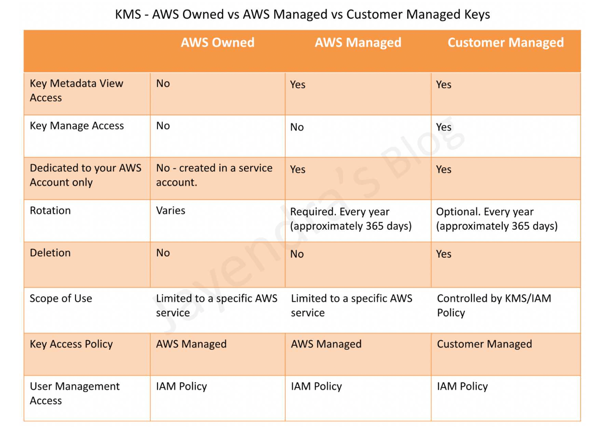
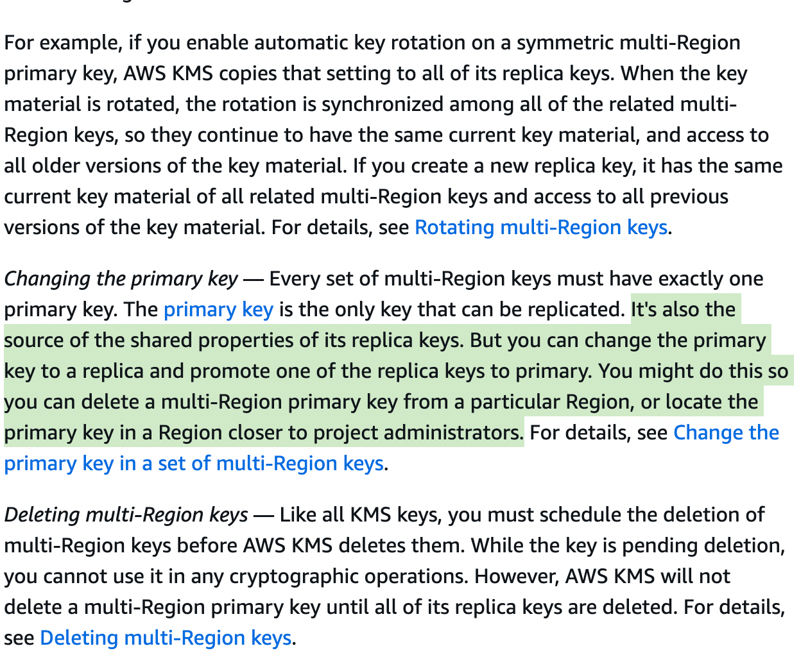
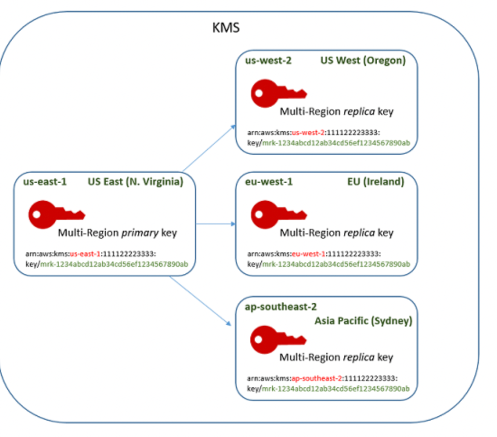

# Domain 5 - Data Protection
- CloudHSM
## KMS
- KMS is a managed service that makes it easy for you to create and control the encryption keys used to encrypt your data + uses Hardware Security Modules (HSMs) to protect the security of your keys.
- KMS is region-specific.
**Customer-Master-Keys (CMK)**: Is a logical representation of a master key, typically used to generate/encrypt/decrypt Data Keys used to encrypt your actual data - this practice is known as Envelope Encryption.
CMKs consist of:
    - Alias
    - Creation date
    - Description
    - Key state
    - Key material (either customer provided or AWS provided)
- CMKs can `NEVER` be exported.
- You cannot delete CMKs immediately, only disable them with a `7-30` day waiting period before deletion.
#### There are three types of CMKs:
    - Customer managed CMKs - customer owned / imported keys in your account (full control)
    - AWS managed CMKs - AWS managed keys in your account that are associated with an AWS service. Automatically rotate them every year. Can view the key policy and audit in cloudtrail but cannot change them. Eg: S3, EBS, Redshift, DynamoDB.
    - AWS owned CMKs - AWS owned keys that are NOT in your account for securing data in multiple AWS accounts (no control).
    - You cannot view, audit or track these keys.

### Key Material Origin:
- Key material origin is a KMS key property that identifies the source of the key material in the KMS key. This origin cannot be changed after creation.
- Symmetric encryption KMS keys can have one of the following key material origin values.
- AWS KMS
    - AWS KMS creates and manages the key material for the KMS key in AWS KMS.
- **EXTERNAL**:
    - Key has imported key material. 
    - Management and security of the key are the customer’s responsibility.
    - `Only symmetric keys are supported`.
    - Automatic rotation is not supported and needs to be `manually rotated` for external key material.
    - Asymmetric keys must be generated within the service itself.
- **Cloud HSM**: AWS KMS creates key material in custom key store(CLOUD HSM) and manages it there. The keys live in the hsm cluster also and minimum required is 2 active HSM Clusters for HA.
- **EXTERNAL_KEY_STORE**: Key material is a cryptographic key in an external key manager outside of AWS.
### KMS Multi-Region Keys
https://docs.aws.amazon.com/kms/latest/developerguide/mrk-how-it-works.html
- AWS KMS supports multi-region keys, which are AWS KMS keys in different AWS Regions that can be used interchangeably – as though you had the same key in multiple Regions.

- Multi-Region keys have the `same key material and key ID`, so data can be encrypted in one AWS Region and decrypted in a different AWS Region without re-encrypting or making a cross-Region call to AWS KMS.
- Primary key in one region and all others are just replicas.
- Can promote replicas to it's own primary key
- Multi-Region keys never leave AWS KMS unencrypted.
- Multi-Region keys are not global and each multi-region key needs to be replicated and managed independently.

- **Symmetric Only:** Multi-region keys support only symmetric cryptography and must be generated within AWS KMS rather than imported.
- **Primary and Replica Model:** A multi-region key is first created as a primary key in one region and then replicated to other regions as replica keys, each with a unique key ARN and key ID while sharing identical key material.
- **Encryption/Decryption Consistency:** The identical cryptographic material across regions allows data encrypted in one region to be decrypted in any other region with a replica.
- **Active-Active Use Cases:** These keys support active-active scenarios, enabling seamless encryption and decryption across multiple regions for low latency and high availability.
- **Key Policies and IAM Integration:** Multi-region keys are governed by AWS KMS key policies and integrated with IAM, ensuring tightly controlled access and management across regions.
- **CloudTrail Logging and Auditing:** All key operations, including encryption, decryption, replication, and state changes, are logged in AWS CloudTrail for compliance and auditing purposes.
- **Key Rotation Propagation:** Rotating a primary multi-region key automatically propagates the rotation to its associated replica keys.
- **Independent Regional Management:** While replicas share the same key material, management actions like disabling or scheduling deletion are handled independently per region, and deleting the primary does not automatically delete replicas.
- **One-Way Replication:** Replication is one-way from the primary to replicas; updates on the primary (such as key rotation) propagate to replicas, but changes made on replicas do not affect the primary.
- **Disaster Recovery and Compliance:** Multi-region keys are ideal for disaster recovery, ensuring continued encryption capabilities if a region becomes unavailable and helping meet regional compliance requirements.

### KMS GRANTS:
1. **Purpose of KMS Grants**  
   - KMS grants provide **temporary and least-privilege access** to KMS keys without modifying the key policy or IAM permissions.  
   - They allow **delegation of permissions** for a specific operation or set of operations.  

2. **Grant Components**  
   - **KMS Key**: The key to which the grant applies.  
   - **Grantee Principal**: The IAM principal (user, role, or service) that receives permissions.  
   - **Operations**: The specific KMS API actions allowed (e.g., `Encrypt`, `Decrypt`, `GenerateDataKey`).  
   - **Constraints (Optional)**: Conditions on key usage, such as encryption context restrictions.  
   - **Retiring Principal (Optional)**: The IAM principal that can retire (delete) the grant. 
    ```sh
    aws kms create-grant \
    --key-id "arn:aws:kms:us-east-1:123456789012:key/abcd1234-efgh-5678-ijkl-9876543210mn" \
    --grantee-principal "arn:aws:iam::123456789012:role/DecryptionRole" \
    --operations "Decrypt" \
    --constraints EncryptionContextEquals="{\"Project\":\"SecureApp\"}" \
    --retiring-principal "arn:aws:iam::123456789012:user/AdminUser"
    ```

3. **Common Operations Allowed in Grants**  
   - `Encrypt`, `Decrypt`, `ReEncryptFrom`, `ReEncryptTo`  
   - `GenerateDataKey`, `GenerateDataKeyWithoutPlaintext`  
   - `DescribeKey`, `CreateGrant`, `RetireGrant`, `RevokeGrant`  

4. **Grant Creation & Permissions**  
   - Grants can be created using `CreateGrant` API.  
   - Only IAM users/roles with `kms:CreateGrant` permission on the key can create a grant.  
   - The grant allows the **grantee principal** to perform only the specified operations.  

5. **Grant Lifecycle**  
   - **Active Grant**: Available for use after creation.  
   - **Revoked Grant**: Can be revoked using `RevokeGrant` API (only key administrators can revoke).  
   - **Retired Grant**: The retiring principal can call `RetireGrant` to disable it.  
   - **Expired Grant**: Automatically expires if a specified `RetiringPrincipal` or grant time limit is set.  

6. **Grant Constraints**  
   - Used to restrict usage based on **encryption context**.  
   - Example: A grant allowing decryption only when a specific encryption context is provided.  

7. **Performance Considerations**  
   - Grants are stored in AWS KMS and are **checked at every API call**, adding slight overhead.  
   - Using a large number of grants per key can impact performance.  

8. **Use Cases**  
   - Delegating access to AWS services (e.g., S3, EBS) without modifying IAM policies.  
   - `Allowing temporary decryption access to an application or external user.`  
   - Restricting key usage to specific conditions via encryption context constraints.  

9. **Grant vs. Key Policy vs. IAM Policy**  
   - **Key Policy**: Defines overall key permissions (long-term, persistent).  
   - **IAM Policy**: Attaches permissions to IAM users, roles, or groups.  
   - **Grant**: Temporary and fine-grained permissions for specific KMS operations.  

